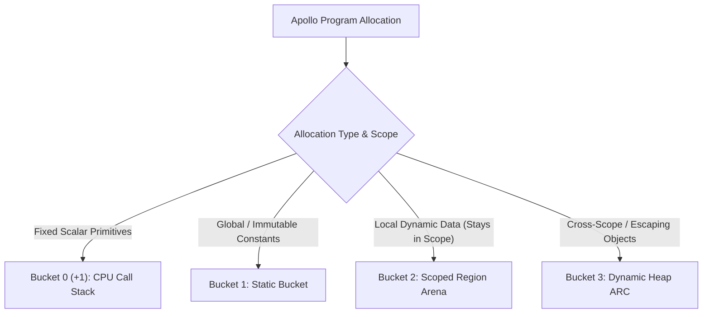

# Apollo 3+1 Bucket Memory Architecture

## Executive Overview

Apollo utilizes a deterministic **3+1 Bucket Memory Architecture** that combines **CPU Call Stack allocation (`alloca`)**, **Scoped Region Arenas**, and **Automatic Reference Counting (ARC)**.

This hybrid model eliminates Garbage Collector (GC) latency pauses while bypassing 90%+ of ARC reference-counting overhead, providing C/Rust-level execution speeds with Swift-like memory safety.

---

## The 3+1 Bucket Classification Matrix



| Bucket | Memory Region | Target Data Types | Lifespan | Deallocation Cost | ARC Overhead |
| :--- | :--- | :--- | :--- | :--- | :--- |
| **Bucket 0 (+1)** | CPU Call Stack (`alloca`) | `int`, `char`, `float`, `bool`, stack `ptr` | Function Frame LIFO | $O(1)$ CPU Frame Pop | **0%** (Disabled) |
| **Bucket 1** | Static Data Segment | `static str`, global constants, literals | Entire Process Execution | Process Exit | **0%** (Disabled) |
| **Bucket 2** | Scoped Region Arena | Local `str`, `array`, `dict`, `struct` | Function / Block Scope | $O(1)$ Bulk Arena Reset | **0%** (Disabled) |
| **Bucket 3** | Dynamic Heap | Returned structs, escaping objects | Reference-Counted | `retain` / `release` when `count == 0` | Active on escape |

---

## Detailed Bucket Architecture

### Bucket 0 (+1): CPU Call Stack
- **Mechanism**: LLVM `alloca` instruction allocating fixed scalar primitives inside the CPU stack frame.
- **Use Case**: `int`, `char`, `float`, `bool`, and fixed pointer variables.
- **Performance**: Zero-cost hardware stack pointer (`rsp`) manipulation.

### Bucket 1: Static Bucket
- **Mechanism**: LLVM `LLVMBuildGlobalStringPtr` and static data segment allocations.
- **Use Case**: String literals (`"Hello"`), global constants, compile-time metadata.
- **Performance**: Zero runtime allocation/deallocation overhead.

### Bucket 2: Scoped Region Arena *(The Speed Engine)*
- **Mechanism**: Linear bump allocation (`offset += size`) inside a pre-allocated per-thread arena buffer.
- **Use Case**: 90% of dynamic data (strings, arrays, dictionaries, structs) that remain inside function or block scopes.
- **Performance**: Deallocation is a single $O(1)$ pointer reset (`arena->used = mark`) when the scope or function exits.
- **Loop Bookmark Optimization**: Automatically emits an inner-scope reset at the end of each loop iteration (`arena->used = loop_bookmark`) to prevent parent memory accumulation spikes.

### Bucket 3: Dynamic Heap ARC *(Escaping Data)*
- **Mechanism**: Prepend an 8-byte metadata header (`ref_count`) to objects that outlive function scopes.
- **Use Case**: Objects explicitly marked with `heap` or returned to caller frames.
- **Performance**: Automatic Reference Counting (`_apl_arc_retain` / `_apl_arc_release`). Memory is reclaimed the exact microsecond `ref_count` drops to zero.

---

## The Parent Arena Allocation Pattern (Zero-Cost Returns)

When a child function returns a dynamic value (string, array, or struct) to a parent function:
1. The child function receives a pointer to the **Parent Function's Bucket 2 Arena**.
2. The child allocates the returned value directly inside the **Parent's Arena**.
3. When the child finishes, the child's local Arena wipes, but the returned value stays safely alive in the Parent's Arena.
4. **Result**: Dynamic returns execute with **0 Heap allocations and 0 ARC overhead**.

---

## Syntax Specification

```apl
// Bucket 1: Static Global Data (0% ARC)
static str APP_NAME = "Apollo Engine";
const int MAX_USERS = 1000;

// Bucket 3: Heap ARC Function (Escaping Objects)
fxn create_user(str name) -> heap User* {
    heap User* u = heap User{ name: name };
    return u; // Retained via ARC
}

// Main Function (Bucket 0, Bucket 2, & Loop Bookmarks)
fxn run() -> void {
    // Bucket 0 (+1): CPU Stack (0% ARC)
    int count = 42;
    char flag = 'A';
    int* ptr = &count;

    // Bucket 2: Scoped Region Arena (0% ARC, Bulk Reset)
    str log_msg = "Initializing...";
    int[] temp_scores = [90, 85, 95];

    // Bucket 3: Received Heap ARC Object
    User* active_user = create_user("Caleb");

    // Loop Reset Bookmark (Flat Memory Across Iterations)
    for (int i = 0; i < 1000; i++) {
        str loop_temp = "Iteration data";
        println(loop_temp);
    } // Wipes loop_temp at the end of each iteration!

} // End of run(): Stack popped, Bucket 2 Arena wiped in 1us, Bucket 3 released via ARC.
```

---

## Primary Use Cases

1. **High-Performance Web Servers & APIs**: Per-request Bucket 2 Arenas ensure 100,000 requests/sec with zero GC latency spikes.
2. **Game Engines & Real-Time Graphics**: Per-frame Bucket 2 Arenas guarantee flat 144 FPS rendering with zero frame stutter.
3. **Compilers & Data Parsers**: Per-file AST Arenas deliver blazing fast compilation speeds with minimal memory footprint.
4. **Embedded & Edge Computing**: Operates in tight memory bounds without the 2x-3x RAM overhead required by garbage collectors.
