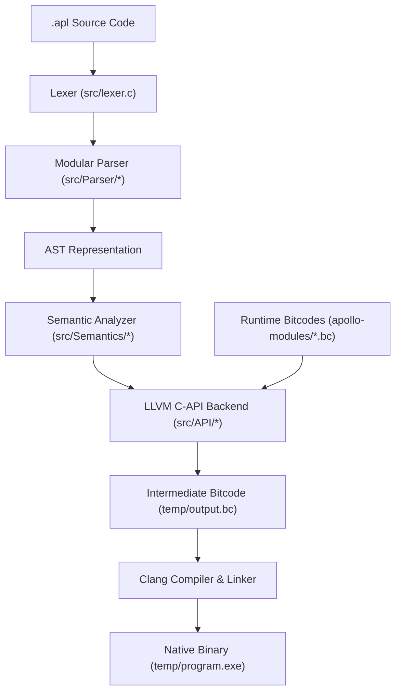

# Apollo Programming Language

**Version:** `v3.0.0.WIP-preview`  
**Release Channel:** Active Development / Unstable Preview  
**Version Format:** `MAJOR.MINOR.PATCH.TAG`

Apollo is a modern compiled programming language featuring a modular custom compiler frontend and LLVM C-API backend written in C99. The compilation pipeline tokenizes and parses Apollo source code (`.apl`), executes static semantic analysis with strict type inference, generates LLVM IR bitcode using the official LLVM C API (`libLLVM-19`), links modular pre-compiled runtime libraries (`apollo-modules`), and compiles down to native executable binaries (`.exe`).

---

## Project Layout

```text
Apollo/
├── CMakeLists.txt              # Build system configuration (CMake 3.20+, MinGW & LLVM-19)
├── Contributions.md            # Guidelines for open-source contributions
├── LICENSE                     # MIT Open Source License
├── PERFORMANCE.md              # Benchmarks and performance analysis
├── README.md                   # Project documentation and architectural overview
├── Task.md                     # Roadmap and Object-Oriented Programming (OOP) migration plan
├── run.sh                      # One-shot build & execution shell script
├── diagnosis.sh                # Compiler pipeline diagnostic tool
├── caleb.apl                   # Sample Apollo source program
├── apollo-modules/             # Pre-compiled runtime library bitcodes linked during LLVM codegen
│   ├── compile.sh              # Shell script to compile runtime C modules to LLVM bitcode
│   ├── APLMODULES.md           # Runtime module specification and architecture
│   ├── apl-io/                 # I/O primitives & string printing runtime (`apl-io.c`, `apl-io.h`, `apl-io.bc`)
│   ├── apl-string/             # String manipulation runtime (`apl-string.c`, `apl-string.h`, `apl-string.bc`)
│   └── apl-sys/                # System calls and OS interop runtime (`apl-sys.c`, `apl-sys.h`, `apl-sys.bc`)
├── docs/                       # Web-based interactive documentation application
│   ├── index.html              # Documentation app HTML shell
│   ├── package.json            # Node.js dependencies and script definitions (Vite + React)
│   ├── vite.config.js          # Vite build system configuration
│   └── src/                    # Documentation web application components (`App.jsx`, `index.css`)
├── headers/                    # Core compiler C header declarations
│   ├── ast.h                   # Abstract Syntax Tree (AST) node structures and constructors
│   ├── defs.h                  # Global compiler context, AST node types, and data types
│   ├── error.h                 # Rich error diagnostic stack and reporting structures
│   ├── functions.h             # Function signature tracking and symbol table entries
│   ├── llvm_backend.h          # LLVM C-API backend prototypes and `LLVMComponents` struct
│   ├── memory.h                # Arena memory allocator interface
│   ├── parser.h                # Recursive descent parser state and entry declarations
│   ├── semantic.h              # Semantic analyzer context and validation prototypes
│   ├── token.h                 # Lexer tokens, token types, and scanner state
│   └── variables.h             # Scope levels and symbol table variable tracking
├── src/                        # Modular C source code implementation
│   ├── main.c                  # Compiler driver entry point (`main()`)
│   ├── ast.c                   # AST allocation, node construction, and tree utilities
│   ├── error.c                 # Error stack allocation and formatted diagnostic output
│   ├── lexer.c                 # Tokenizer / Scanner engine
│   ├── memory.c                # Arena memory manager allocation & reset routines
│   ├── variables.c             # Variable symbol table allocation and scope management
│   ├── API/                    # LLVM Code Generation Engine (C-API)
│   │   ├── llvm_main.c         # LLVM environment setup, module verification, runtime linking, & file output
│   │   ├── llvm_fxns.c         # Code generation for function declarations and calls
│   │   ├── llvm_condbr.c       # Code generation for `if`/`else` conditionals, `while` and `for` loops
│   │   ├── llvm_variables.c    # Code generation for variable allocation (`alloca`), loads, stores, and in-place ops
│   │   └── llvm_helpers.c      # LLVM IR builder helper utilities and type conversions
│   ├── Parser/                 # Recursive Descent Parser Modules
│   │   ├── parser_entry.c      # High-level entry point (`compile_parse()`) and program block parsing
│   │   ├── parser_expr.c       # Expression parser with precedence climbing (Pratt parsing)
│   │   ├── parser_functions.c  # Function declaration and parameter list parsing
│   │   ├── parser_var.c        # Variable declaration and assignment statement parsing
│   │   └── parser_helpers.c    # Parsing utility functions, token matching, and panic-mode error recovery
│   └── Semantics/              # Static Type Checker & Analyzer
│       ├── semantic_analyze.c  # AST traversal for static semantic checks and symbol validation
│       └── semantic_helpers.c  # Type checking helpers and scope validation utilities
├── tests/                      # Automated Python testing suite & benchmark cases
│   ├── test.py                 # Primary test suite execution runner
│   ├── conditionals.py         # Test cases for control flow structures (`if`/`else`, loops)
│   ├── fxns.py                 # Test cases for function calls and recursion
│   ├── println.py              # Test cases for standard output printing
│   ├── variable.py             # Test cases for variable scope and type declarations
│   └── performance/            # Performance and stress test benchmarks
└── temp/                       # Intermediate artifacts (`output.bc`, `output.ll`, `program.exe`)
```

---

## Quick Start & Building

### Prerequisites

- **GCC / MinGW-w64** (C99 compliant compiler)
- **CMake** (v3.20 or newer)
- **LLVM 19** development headers & libraries (`libLLVM-19`)
- **Clang** (Used as native linker and LLVM bitcode compiler)

---

### 1. Automated Build & Run via `run.sh`

The project includes a shell helper script (`run.sh`) that manages build directory setup, CMake configuration, compilation, and execution of `.apl` scripts:

```bash
# Build compiler and execute a source file
./run.sh caleb.apl

# Run existing build without re-triggering CMake configuration
./run.sh build caleb.apl
```

---

### 2. Manual CMake Build

To build the compiler executable (`apollo.exe`) manually using CMake:

```powershell
# Create build directory and generate MinGW Makefiles
cmake -B build -G "MinGW Makefiles" -DCMAKE_EXPORT_COMPILE_COMMANDS=ON

# Build target executable
cmake --build build

# Execute an Apollo script
./build/apollo.exe caleb.apl
```

---

### 3. Direct GCC Build Command

If compiling directly without CMake via MinGW-w64:

```powershell
gcc src/main.c src/ast.c src/error.c src/lexer.c src/memory.c src/variables.c `
    src/API/*.c src/Parser/*.c src/Semantics/*.c `
    -Isrc -Isrc/API -Isrc/Parser -Isrc/Semantics -Iheaders `
    -IC:\msys64\mingw64\include `
    -LC:\msys64\mingw64\lib `
    -lLLVM-19 -o build/apollo.exe

./build/apollo.exe caleb.apl
```

---

### 4. VS Code Task Integration

Open any `.apl` script in VS Code and press `Ctrl + Shift + B` to trigger the pre-configured build task in `.vscode/tasks.json`.

---

## Compiler Architecture & Pipeline



### Pipeline Phases

1. **Lexical Analysis (`src/lexer.c`)**:
   - Converts source text into a stream of typed tokens (`TOKEN_INT`, `TOKEN_IDENTIFIER`, `TOKEN_IF`, `TOKEN_FXN`, etc.).
   - Tracks exact source line numbers and positions for diagnostic reporting.
2. **Modular Syntactic Parsing (`src/Parser/`)**:
   - Built using a recursive descent architecture split into focused sub-modules (`parser_var.c`, `parser_functions.c`, `parser_expr.c`).
   - Expressions are parsed using **Pratt Precedence-Climbing** (`parser_expr.c`) to handle binary and unary operator precedence cleanly.
   - Features **Panic-Mode Error Recovery** (`synchronize()` in `parser_helpers.c`) to isolate parsing errors without cascading failures.
3. **Static Semantic Analysis & Type Inference (`src/Semantics/`)**:
   - Traverses the AST to check symbol accessibility, variable initialization, and scope level boundaries.
   - Performs static type checking and evaluates boolean/comparison expressions (`>`, `<`, `>=`, `<=`, `==`, `!=`, `and`, `or`).
4. **LLVM Code Generation & Runtime Linking (`src/API/`)**:
   - Emits optimized LLVM IR bitcode using the official `libLLVM-19` C API.
   - Dynamically loads and links pre-compiled runtime bitcodes from `apollo-modules/` (`apl-io.bc`, `apl-string.bc`, `apl-sys.bc`) via `LLVMLinkModules2`.
   - Validates generated LLVM modules using `LLVMVerifyModule`.
   - Writes compiled bitcode to `temp/output.bc`.
5. **Native Execution**:
   - Calls `clang -O3 temp/output.bc -o temp/program.exe` to emit fully compiled, optimized Windows executable binaries.

---

## Language Syntax & Features

### Function Declarations

Functions are declared using the `fxn` keyword. The `run()` function serves as the primary entry point:

```apl
fxn add(a, b) {
    return a + b;
}

fxn run() -> (void) {
    var result = add(10, 20);
    println("Result: ", result);
}
```

### Variables and Types

Apollo supports strong typing with auto-inference or explicit declaration keywords (`var`, `#int`, `#float`, `#bool`, `#str`):

```apl
var count = 10;
var name = "Apollo";
var is_active = true;

# In-place assignments and increments
count++;
count += 5;
```

### Control Flow

#### `if` / `else` Conditional Branches
```apl
if (count > 10) {
    println("Count is greater than 10");
} else {
    println("Count is 10 or less");
}
```

#### `while` Loops
```apl
var i = 0;
while (i < 5) {
    println("Iteration: ", i);
    i++;
}
```

#### `for` Loops
```apl
for (var j = 0; j < 10; j++) {
    println("Value: ", j);
}
```

---

## Standard Runtime Modules (`apollo-modules/`)

Apollo delegates common runtime operations to modular C sub-libraries compiled into LLVM bitcode:

- **`apl-io`**: Handles formatted console I/O, string printing, and scalar output.
- **`apl-string`**: Supplies string allocation, concatenation, length, and slice helpers.
- **`apl-sys`**: Provides OS-level utilities, memory allocation wrappers, and process operations.

To re-compile runtime modules to LLVM bitcode:
```bash
cd apollo-modules
./compile.sh apl-io
./compile.sh apl-string
./compile.sh apl-sys
```

---

## Testing & Quality Assurance

Apollo includes an automated test runner suite written in Python located in `tests/`:

```powershell
# Run the test suite
python tests/test.py
```

---

## Frontend Documentation Portal (`docs/`)

The repository includes a modern React + Vite documentation site under `docs/`.

To launch the documentation portal locally:
```powershell
cd docs
npm install
npm run dev
```

---

## Roadmap

See [Task.md](file:///c:/Users/caleb/SCXRPIUS/Apollo/Task.md) for the active Object-Oriented Programming (OOP) evolution checklist, including upcoming support for:
- Classes and Struct Data Encapsulation
- Object Instantiation (`new`)
- Member Access Dot Operator (`.`)
- Method Dispatch and `this` Pointer Passing
- Struct Embedding and V-Table Polymorphism

---

## License

Apollo is released under the **MIT License**. Feel free to modify, build upon, and distribute under its terms.
