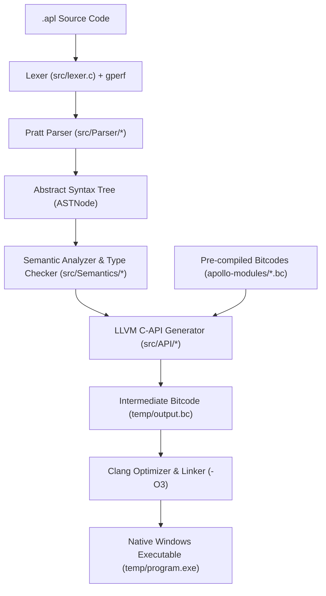
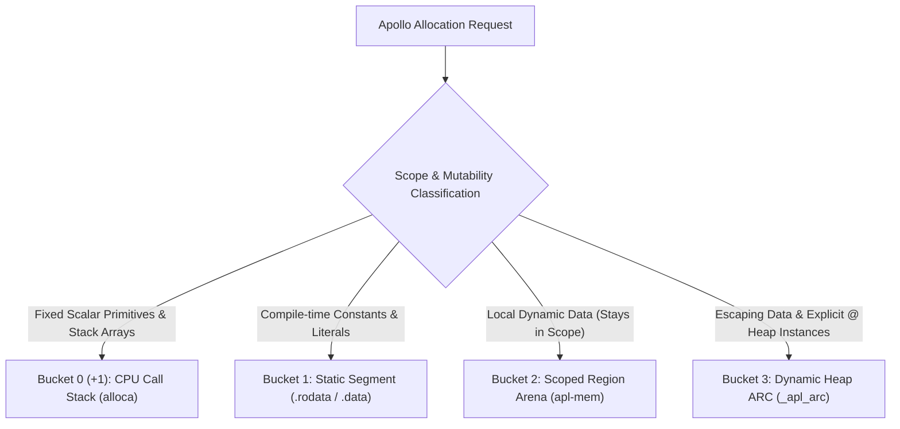

# Apollo Programming Language

**Version:** `v3.0.0-unstable-preview`  
**Release Channel:** Active Development / Unstable Preview  
**Target Architecture:** `x86_64-w64-windows-gnu` / Windows Native  
**Compiler Backend:** LLVM 19 C-API (`libLLVM-19`) + Clang Linker

Apollo is a modern, high-performance compiled programming language combining the raw speed and deterministic control of C with modern syntax abstractions (struct encapsulation, methods, static & dynamic arrays, pointers) and an innovative **3+1 Bucket Memory Architecture**. The compilation pipeline tokenizes source code (`.apl`), constructs an Abstract Syntax Tree (AST) via recursive descent Pratt parsing, executes static type-checking and semantic validation, emits LLVM IR bitcode using the official LLVM C API (`libLLVM-19`), dynamically links pre-compiled runtime bitcodes (`apollo-modules`), and compiles directly down to optimized native executable binaries (`.exe`).

---

## Table of Contents

1. [Project Layout & Architecture](#project-layout--architecture)
2. [Quick Start & Toolchain Setup](#quick-start--toolchain-setup)
3. [Compiler Pipeline & Workflow](#compiler-pipeline--workflow)
4. [3+1 Bucket Memory Architecture](#31-bucket-memory-architecture)
5. [Language Syntax & Feature Guide](#language-syntax--feature-guide)
   - [Program Entry Point](#program-entry-point)
   - [Variables, Types & Constants](#variables-types--constants)
   - [Pointers & Memory Referencing](#pointers--memory-referencing)
   - [Static & Dynamic Arrays](#static--dynamic-arrays)
   - [Structs, Methods (`fxns`), and `self`](#structs-methods-fxns-and-self)
   - [Control Flow (`if`/`elif`/`else`, `while`, `for`)](#control-flow)
   - [Console Output (`println`)](#console-output)
6. [Standard Runtime Modules (`apollo-modules/`)](#standard-runtime-modules-apollo-modules)
7. [Testing & Quality Assurance](#testing--quality-assurance)
8. [Documentation Portal (`docs/`)](#documentation-portal-docs)
9. [Related Architecture Specifications](#related-architecture-specifications)
10. [License](#license)

---

## Project Layout & Architecture

```text
Apollo/
├── CMakeLists.txt              # CMake build configuration (MinGW & LLVM-19)
├── Contributions.md            # Open-source contribution guidelines
├── DATA_STRUCTURES.md          # Data structures & memory layout specification
├── IMPROVEMENTS.md             # Memory optimization and scaling roadmap
├── LICENSE                     # MIT Open Source License
├── MEMORY.md                   # 3+1 Bucket Memory Architecture specification
├── PERFORMANCE.md              # Compiler & runtime optimization benchmarks
├── README.md                   # Master project documentation
├── Task.md                     # OOP migration roadmap & checklist
├── run.sh                      # One-shot build and execution script (Git Bash / MSYS2)
├── diagnosis.sh                # Compiler pipeline diagnostic test runner
├── caleb.apl                   # Sample Apollo program demonstrating structs & methods
├── apollo-modules/             # Pre-compiled C runtime libraries linked during codegen
│   ├── compile.sh              # Runtime bitcode compilation script
│   ├── APLMODULES.md           # Runtime sub-libraries specification
│   ├── apl-io/                 # I/O primitives & scalar printing (`.c`, `.h`, `.bc`)
│   ├── apl-mem/                # 3+1 Bucket memory engine (Arena & ARC) (`.c`, `.h`, `.bc`)
│   ├── apl-string/             # String manipulation runtime (`.c`, `.h`, `.bc`)
│   └── apl-sys/                # System calls and OS interop (`.c`, `.h`, `.bc`)
├── docs/                       # Web-based interactive documentation application
│   ├── index.html              # Documentation portal HTML shell
│   ├── package.json            # Node.js dependencies (Vite + React)
│   ├── vite.config.js          # Vite build configuration
│   └── src/                    # UI components, syntax highlighter & styling
├── headers/                    # Core compiler C header declarations
│   ├── ast.h                   # AST node structures, unions, and constructors
│   ├── defs.h                  # Global compiler context, definitions, and debug tracing
│   ├── error.h                 # Error stack allocation and formatted diagnostic reporting
│   ├── functions.h             # Function & method signature tracking and metadata
│   ├── keywords_hash.h         # GNU gperf hash table for O(1) keyword resolution
│   ├── llvm_backend.h          # LLVM C-API backend prototypes and LLVMComponents state
│   ├── memory.h                # Compiler-internal Arena memory allocator interface
│   ├── parser.h                # Recursive descent parser state and parsing entry points
│   ├── semantic.h              # Semantic analyzer context, type checking, and validation
│   ├── token.h                 # Lexer tokens, token types, and scanner state
│   └── variables.h             # Symbol table, scopes, data types, and memory buckets
├── src/                        # Modular C source code implementation
│   ├── main.c                  # Compiler driver entry point (`main()`) & process orchestrator
│   ├── ast.c                   # AST allocation, node construction, and tree utilities
│   ├── error.c                 # Diagnostic error stack and visual snippet printing
│   ├── lexer.c                 # Tokenizer / Scanner engine with gperf keyword lookups
│   ├── memory.c                # Compiler Arena memory manager allocation & reset routines
│   ├── variables.c             # Variable symbol table (FNV-1a hash table) & scope management
│   ├── gperf/
│   │   └── keywords.gperf      # GNU gperf hash table definition for language keywords
│   ├── API/                    # LLVM Code Generation Engine (libLLVM-19 C-API)
│   │   ├── llvm_main.c         # Module setup, bitcode loading, verification, & output
│   │   ├── llvm_fxns.c         # Function prologue/epilogue, nested frames, arena returns
│   │   ├── llvm_condbr.c       # Control flow: if/else branches, while/for loops & loop marks
│   │   ├── llvm_variables.c    # Variable allocation by bucket, loads, stores, in-place ops
│   │   ├── llvm_arrays.c       # Static array alloca, dynamic array headers, bounds checks
│   │   ├── llvm_structs.c      # Named LLVM struct types, GEP field resolution, member access
│   │   ├── llvm_memory.c       # 3+1 Bucket memory codegen (Arena create/reset, Heap ARC)
│   │   └── llvm_helpers.c      # Binary/unary expressions, GEP address helpers, optimization
│   ├── Parser/                 # Recursive Descent Pratt Parser Modules
│   │   ├── parser_entry.c      # Parsing driver entry point (`compile_parse()`) & global scope
│   │   ├── parser_data_structures.c # Array literals, indexing, struct defs, & fxns blocks
│   │   ├── parser_expr.c       # Pratt expression parser with operator precedence climbing
│   │   ├── parser_functions.c  # Function declarations, return types, and parameter lists
│   │   ├── parser_var.c        # Variable declarations, assignments, pointers, & control flow
│   │   └── parser_helpers.c    # Token matching, panic-mode recovery (`synchronize()`), utils
│   └── Semantics/              # Static Type Checker & Analyzer
│       ├── semantic_analyze.c  # AST traversal for static type checking & symbol verification
│       └── semantic_helpers.c  # Type compatibility, pointer level inference, & struct lookups
├── tests/                      # Automated Python test runner & benchmark suite
│   ├── test.py                 # Primary automated test runner
│   ├── conditionals.py         # Control flow test cases (if/else, while, for)
│   ├── fxns.py                 # Function calls, recursion, and return value test cases
│   ├── println.py              # Console I/O and formatted output test cases
│   ├── variable.py             # Scope levels, pointers, arrays, and type declaration tests
│   └── performance/            # Performance and stress test benchmarks
└── temp/                       # Intermediate compiler artifacts (`output.bc`, `program.exe`)
```

---

## Quick Start & Toolchain Setup

### Prerequisites

- **GCC / MinGW-w64** (C99-compliant compiler toolchain)
- **CMake** (v3.20 or newer)
- **LLVM 19** development headers & libraries (`libLLVM-19`)
- **Clang** (Used as native Windows linker and LLVM bitcode compiler)
- **Python 3.8+** (For automated diagnostic and doctest execution)

---

### 1. Automated Build & Run via `run.sh`

The included `run.sh` script automates CMake configuration, building the compiler, and executing an `.apl` source file:

```bash
# Build compiler and execute an Apollo program
./run.sh caleb.apl

# Run existing build without re-triggering CMake configuration
./run.sh build caleb.apl
```

---

### 2. Manual CMake Build

To configure and compile `apollo.exe` manually using CMake:

```powershell
# Create build directory and generate MinGW Makefiles
cmake -B build -G "MinGW Makefiles" -DCMAKE_EXPORT_COMPILE_COMMANDS=ON

# Compile the target executable
cmake --build build

# Execute an Apollo program
./build/apollo.exe caleb.apl
```

---

### 3. Direct GCC Build Command

To compile the compiler directly with MinGW-w64 GCC without CMake:

```powershell
gcc src/main.c src/ast.c src/error.c src/lexer.c src/memory.c src/variables.c `
    src/API/*.c src/Parser/*.c src/Semantics/*.c `
    -Isrc -Isrc/API -Isrc/Parser -Isrc/Semantics -Iheaders `
    -IC:\msys64\mingw64\include `
    -LC:\msys64\mingw64\lib `
    -lLLVM-19 -o build/apollo.exe

./build/apollo.exe caleb.apl
```

---

### 4. Compiler Diagnostics via `diagnosis.sh`

Run the diagnostic suite to validate language features across test suites:

```bash
# Run all test suites (println, conditionals, variable, fxns)
./diagnosis.sh

# Run an individual test suite
./diagnosis.sh println
./diagnosis.sh conditionals
./diagnosis.sh variable
./diagnosis.sh fxns

# Run compiler performance benchmarks
./diagnosis.sh performance
```

---

## Compiler Pipeline & Workflow



### Pipeline Phases

1. **Lexical Analysis ([`src/lexer.c`](file:///c:/Users/caleb/SCXRPIUS/Apollo/src/lexer.c))**:
   - Converts source text into typed tokens (`TOKEN_INT`, `TOKEN_STRING`, `TOKEN_IDENTIFIER`, `TOKEN_ACCESS`, `DECLARE_STRUCT`, `TOKEN_FXNS`, etc.).
   - Utilizes GNU `gperf` generated hash lookup tables ([`headers/keywords_hash.h`](file:///c:/Users/caleb/SCXRPIUS/Apollo/headers/keywords_hash.h)) for $O(1)$ keyword identification.
   - Tracks exact file lines, columns, and character offsets for rich diagnostic error output.
2. **Modular Syntactic Parsing ([`src/Parser/`](file:///c:/Users/caleb/SCXRPIUS/Apollo/src/Parser))**:
   - Built with recursive descent and Pratt Precedence Climbing ([`parser_expr.c`](file:///c:/Users/caleb/SCXRPIUS/Apollo/src/Parser/parser_expr.c)) for binary, unary, and postfix member access expressions.
   - Parses struct definitions, `fxns` method blocks, parameter lists, array initializers, and control flow.
   - Implements Panic-Mode error recovery (`synchronize()` in [`parser_helpers.c`](file:///c:/Users/caleb/SCXRPIUS/Apollo/src/Parser/parser_helpers.c)) to isolate syntax errors cleanly.
3. **Static Semantic Analysis & Type Inference ([`src/Semantics/`](file:///c:/Users/caleb/SCXRPIUS/Apollo/src/Semantics))**:
   - Walks the AST to enforce variable initialization, scope boundaries, and symbol resolution.
   - Resolves pointer indirection levels, verifies struct member existence, and checks array indexing types.
   - Validates memory bucket classifications (Stack, Static, Arena, Heap ARC).
4. **LLVM Code Generation & Runtime Linking ([`src/API/`](file:///c:/Users/caleb/SCXRPIUS/Apollo/src/API))**:
   - Emits optimized LLVM IR bitcode using the official `libLLVM-19` C API.
   - Links pre-compiled runtime bitcodes (`apl-io.bc`, `apl-mem.bc`, `apl-string.bc`, `apl-sys.bc`) via `LLVMLinkModules2`.
   - Generates named struct types, GEP field offsets, arena allocations, and loop bookmarks.
   - Validates LLVM module integrity via `LLVMVerifyModule` and writes bitcode to `temp/output.bc`.
5. **Native Execution**:
   - Invokes `clang -O3 --target=x86_64-w64-windows-gnu temp/output.bc -o temp/program.exe` to produce native Windows binaries.

---

## 3+1 Bucket Memory Architecture

Apollo implements a deterministic **3+1 Bucket Memory Architecture** that unifies hardware call stack allocation (`alloca`), static data segments, scoped region arenas, and Automatic Reference Counting (ARC). This model eliminates Garbage Collector (GC) latency pauses while bypassing 90%+ of ARC overhead. For complete specifications, see [MEMORY.md](file:///c:/Users/caleb/SCXRPIUS/Apollo/MEMORY.md).



| Bucket | Memory Region | Target Data Types | Lifespan | Deallocation Latency | ARC Overhead |
| :--- | :--- | :--- | :--- | :--- | :--- |
| **Bucket 0 (+1)** | CPU Call Stack (`alloca`) | `int`, `char`, `float`, `bool`, `ptr`, `T[N]` | Function Frame LIFO | **0.0 ns** (Stack Pop) | **0%** (Disabled) |
| **Bucket 1** | Static Data Segment | `const`, `static str`, literals, ALL_CAPS | Process Execution | **0.0 ns** (Process Exit) | **0%** (Disabled) |
| **Bucket 2** | Scoped Region Arena | Local `str`, `T[]`, `dict`, local structs | Function / Block Scope | **$O(1)$** Bulk Arena Reset | **0%** (Disabled) |
| **Bucket 3** | Dynamic Heap ARC | Escaping objects, `@var`, cross-scope structs | Reference-Counted | Deterministic (`count == 0`) | Active on escape |

### Key Memory Innovations:
- **Loop Bookmark Optimization**: At each loop iteration, Apollo records an arena bookmark (`apl_arena_get_mark`) and rewinds (`apl_arena_set_mark`), maintaining flat RAM usage even across millions of iterations.
- **Parent Arena Return Pattern**: Child functions returning dynamic data allocate directly inside the parent function's arena (`target_return_arena`), eliminating static escape analysis and heap fragmentation.

---

## Language Syntax & Feature Guide

### Program Entry Point

Every Apollo program defines an entry point function named `run()`:

```apl
fxn run() {
    println("Hello, Apollo!");
}
```

---

### Variables, Types & Constants

Apollo supports type inference via `var` or explicit primitive type declarations (`int`, `float`, `bool`, `char`, `str`):

```apl
// Type Inference
var count = 10;
var pi = 3.14159;
var message = "Compiled with Apollo";
var is_ready = true;

// Explicit Types
int age = 25;
float rate = 0.05;
bool active = false;
char grade = 'A';
str title = "Apollo Language";

// Compile-Time Constants (ALL_CAPS identifiers reside in Bucket 1 Static Segment)
int MAX_CONNECTIONS = 5000;
str APP_VERSION = "3.0.0";

// In-Place Operations & Compound Assignments
count++;
count--;
count += 10;
count -= 2;
count *= 3;
count /= 2;
count %= 5;
```

---

### Pointers & Memory Referencing

Apollo provides C-like pointer capabilities with compile-time safety and automatic dereferencing:

```apl
fxn run() {
    int original = 42;

    // Create a pointer using address-of (&)
    int* ptr = &original;

    // Dereference using (*)
    println("Pointer Address Value: ", *ptr);

    // Modify original value through pointer
    *ptr = 100;
    println("Updated Original: ", original); // Prints 100
}
```

---

### Static & Dynamic Arrays

#### 1. Static Fixed-Size Arrays (`T[N]`)
Fixed arrays are allocated directly on the **CPU Call Stack (Bucket 0)** with zero heap overhead:

```apl
// Declare 5-element integer array
int[5] scores = { 90, 85, 95, 88, 100 };

// Access & mutate by index
scores[0] = 92;
println("First score: ", scores[0]);
```

#### 2. Dynamic Resizable Arrays (`T[]`)
Dynamic arrays reside in the **Scoped Region Arena (Bucket 2)** with automatic bounds checking:

```apl
// Declare dynamic array
int[] dyn_list = { 10, 20, 30, 40 };

// Index access
println("Element at 2: ", dyn_list[2]);
```

---

### Structs, Methods (`fxns`), and `self`

Apollo supports data encapsulation via `struct` definitions and dedicated `fxns` method blocks. Methods can be static or bound to instances via the `self` keyword:

```apl
// 1. Define Struct Layout
struct Math {
    int x;
    int y;
};

// 2. Define Methods and Static Functions
fxns Math {
    // Static Function (Namespace Call)
    pow(int x) -> int {
        return x * x;
    }

    // Instance Method (Mutating State via 'self')
    set(self, int nx, int ny) {
        self.x = nx;
        self.y = ny;
    }

    // Instance Method (Reading State via 'self')
    add(self) -> int {
        return self.x + self.y;
    }
}

// 3. Instantiate and Invoke
fxn run() {
    Math m;
    m.set(40, 60);

    // Call static namespace function
    println("8 squared is: ", Math.pow(8));

    // Call instance method
    println("Sum of m: ", m.add()); // Prints 100
}
```

---

### Control Flow

#### `if` / `elif` / `else` Branching
```apl
var score = 85;

if (score >= 90) {
    println("Grade: A");
} elif (score >= 80) {
    println("Grade: B");
} else {
    println("Grade: C or below");
}
```

#### `while` Loops
```apl
var counter = 0;
while (counter < 5) {
    println("Counter: ", counter);
    counter++;
}
```

#### `for` Loops
```apl
for (var i = 0; i < 10; i++) {
    println("Index: ", i);
}
```

---

### Console Output

The built-in `println()` function accepts variable arguments across different data types:

```apl
var name = "Apollo";
var version = 3;
var speed = 99.9;

println("Language: ", name, " | Version: ", version, " | Performance: ", speed, "%");
```

---

## Standard Runtime Modules (`apollo-modules/`)

Apollo standardizes runtime operations in modular C sub-libraries compiled to LLVM bitcode (`.bc`) and linked during codegen:

| Module | Location | Primary Responsibilities |
| :--- | :--- | :--- |
| **`apl-io`** | [`apollo-modules/apl-io/`](file:///c:/Users/caleb/SCXRPIUS/Apollo/apollo-modules/apl-io) | Formatted console output (`print_int`, `print_float`, `print_bool`, `print_str`, `__apl_print_ptr`, `_apl_panic_out_of_bounds`) |
| **`apl-mem`** | [`apollo-modules/apl-mem/`](file:///c:/Users/caleb/SCXRPIUS/Apollo/apollo-modules/apl-mem) | 3+1 Bucket memory engine (64KB Arena chunk allocator, loop marks, and ARC Heap manager) |
| **`apl-string`** | [`apollo-modules/apl-string/`](file:///c:/Users/caleb/SCXRPIUS/Apollo/apollo-modules/apl-string) | String allocation, slice manipulation, concatenation, and length calculations |
| **`apl-sys`** | [`apollo-modules/apl-sys/`](file:///c:/Users/caleb/SCXRPIUS/Apollo/apollo-modules/apl-sys) | System calls, OS memory allocation wrappers, and process operations |

To recompile runtime bitcode modules after modifying C sources:
```bash
cd apollo-modules
./compile.sh apl-io
./compile.sh apl-mem
./compile.sh apl-string
./compile.sh apl-sys
```

---

## Testing & Quality Assurance

Apollo features an automated test runner suite written in Python located in `tests/`:

```powershell
# Run the complete test suite
python tests/test.py
```

To run feature-specific doctests through `diagnosis.sh`:
```bash
./diagnosis.sh println
./diagnosis.sh conditionals
./diagnosis.sh variable
./diagnosis.sh fxns
```

---

## Documentation Portal (`docs/`)

The repository includes a modern web-based documentation application built with React and Vite in the `docs/` directory.

To run the documentation portal locally:
```powershell
cd docs
npm install
npm run dev
```

---

## Related Architecture Specifications

For in-depth architectural and technical design details, refer to the following repository specifications:

- [MEMORY.md](file:///c:/Users/caleb/SCXRPIUS/Apollo/MEMORY.md): In-depth 3+1 Bucket Memory Architecture specification and benchmarks.
- [DATA_STRUCTURES.md](file:///c:/Users/caleb/SCXRPIUS/Apollo/DATA_STRUCTURES.md): Detailed specification of Apollo's core data structures (Arrays, Maps, Structs, Slices).
- [IMPROVEMENTS.md](file:///c:/Users/caleb/SCXRPIUS/Apollo/IMPROVEMENTS.md): Memory architecture improvement and scaling roadmap.
- [PERFORMANCE.md](file:///c:/Users/caleb/SCXRPIUS/Apollo/PERFORMANCE.md): Compiler build times and runtime binary optimization guide.
- [Task.md](file:///c:/Users/caleb/SCXRPIUS/Apollo/Task.md): Object-Oriented Programming (OOP) migration plan and checklist.
- [APLMODULES.md](file:///c:/Users/caleb/SCXRPIUS/Apollo/apollo-modules/APLMODULES.md): Pre-compiled runtime library specification and architecture.

---

## License

Apollo is open-source software licensed under the **[MIT License](file:///c:/Users/caleb/SCXRPIUS/Apollo/LICENSE)**.

